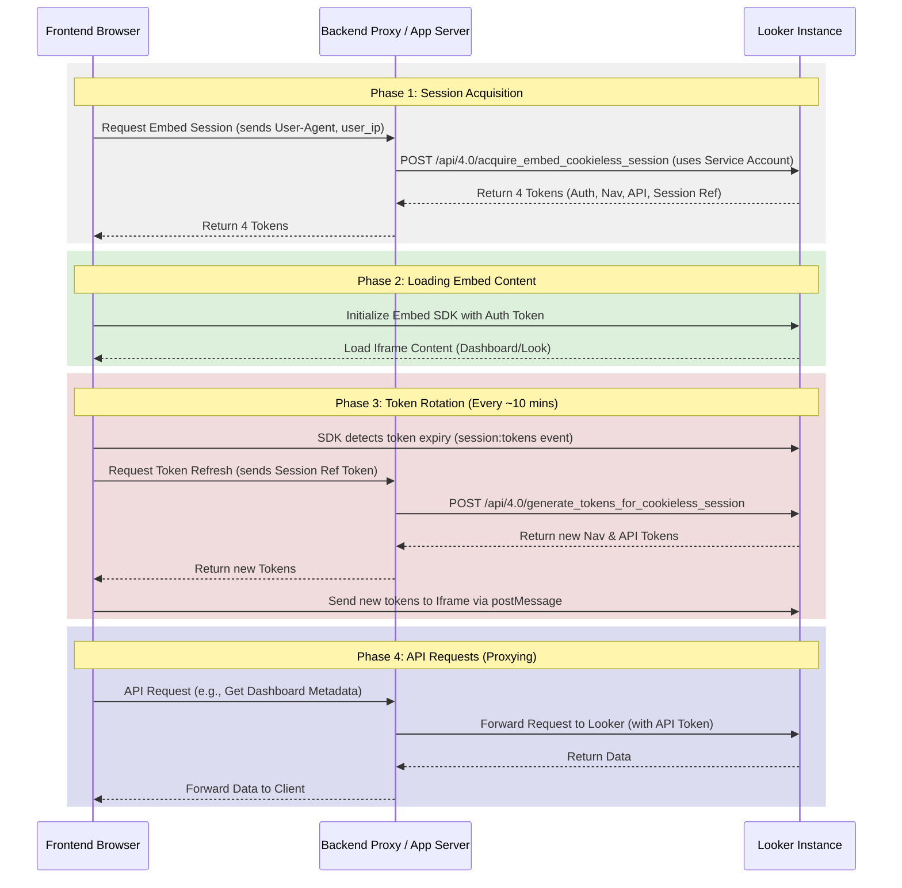

# Looker Embedding Architecture Options

This document provides a detailed technical breakdown of the four primary embedding strategies available in Looker.

---

## Option 1: Signed Embed (Native HMAC-SHA1)

Signed SSO embedding uses an HMAC-SHA1 signature to authenticate users on-the-fly. The host application constructs a specific URL containing user permissions, models, group IDs, and user attributes, signs it with a shared embed secret, and loads it into an iframe.

### Key Characteristics:

- **User Provisioning**: Just-In-Time (JIT). Users are created/updated in Looker dynamically when they access the embed.
- **Third-Party Cookies**: **Required**. Looker sets session cookies in the iframe. If the Looker domain is different from the host app domain, these cookies may be blocked.
- **REST API Access**: No direct frontend access.

### URL Construction & Signature Flow:

The backend must construct a URL with the following structure:
`https://<instance_url>/login/embed/<encoded_url_path>?<query_parameters>&signature=<signature>`

#### Line-feed Order for Signature:

To generate the signature, you must concatenate the following parameters in this exact order, separated by newlines (`\n`):

1. `host` (e.g., `company.looker.com` or `localhost:9999`)
2. `url` (e.g., `/embed/dashboards/1` - must start with `/embed/`)
3. `nonce` (random string, unique per request, max 255 chars)
4. `current_time` (epoch time as a string)
5. `session_length` (session duration in seconds, max 2592000)
6. `external_user_id` (unique identifier for the user in your system)
7. `permissions` (JSON array of Looker permissions)
8. `models` (JSON array of Looker models the user has access to)
9. `group_ids` (JSON array of Looker group IDs - optional)
10. `external_group_id` (unique identifier for group - optional)
11. `user_attributes` (JSON object of key-value pairs)
12. `force_logout_login` (`true` or `false`)

**Example Signature Input (Concatenated String):**

```
company.looker.com
/embed/dashboards/1
"abc123nonce"
"1680000000"
"3600"
"user_12345"
["access_data","see_user_dashboards"]
["marketing_model"]
[]
"group_abc"
{"company":"Acme Co"}
true
```

The signature is the HMAC-SHA1 of this string using the Looker Embed Secret, hex-encoded.

---

## Option 2: Signed Embed (Looker SDK API)

Instead of manually constructing and signing the SSO URL, you can use the Looker SDK's built-in helper method. This reduces the risk of signature mismatches caused by formatting errors.

### Key Characteristics:

- Identical to Option 1 in terms of browser behavior (requires third-party cookies).
- Simplifies backend code by delegating URL construction and signing to the Looker SDK.

### SDK Method:

In Node.js, use `sdk.create_sso_embed_url()`:

```typescript
const ssoUrl = await sdk.ok(
  sdk.create_sso_embed_url({
    target_url: "https://company.looker.com/embed/dashboards/1",
    external_user_id: "user_12345",
    permissions: ["access_data", "see_user_dashboards"],
    models: ["marketing_model"],
    user_attributes: { company: "Acme Co" },
    force_logout_login: true,
    session_length: 3600,
  }),
);
```

---

## Option 3: Embed as Me (Client-Side API)

Embed as Me allows the frontend application to interact directly with the Looker REST API using a "Sudo" token. Instead of JIT provisioning, users must be created ahead-of-time (AOT). The backend authenticates as an admin, obtains a token for the specific user, and passes it to the frontend.

### Key Characteristics:

- **User Provisioning**: Ahead-Of-Time (AOT). The user must already exist in Looker.
- **Third-Party Cookies**: **Not Required**. Authentication is token-based.
- **REST API Access**: **Yes**. The frontend can make direct CORS requests to the Looker API using the Sudo token.

### Authentication Flow:

1. **AOT Provisioning**: The backend ensures the user exists using `create_embed_user()` or similar API calls.
2. **Sudo Login**: The backend calls `login_user(user_id)` to generate an access token representing that user.
3. **Token Delivery**: The backend sends the access token to the frontend.
4. **CORS API Calls**: The frontend uses this token in the `Authorization` header (`Bearer <token>`) to call the Looker REST API directly from the browser.
5. **Embedding**: The frontend initializes the Embed SDK using the token.

---

## Option 4: Cookieless JWT

Cookieless embedding is the modern standard for environments where third-party cookies are blocked. It uses a stateful token exchange protocol and requires a backend proxy to handle REST API requests.

### Key Characteristics:

- **User Provisioning**: Server-managed session.
- **Third-Party Cookies**: **Not Required**.
- **REST API Access**: Yes, but routed through a **Backend Proxy** to avoid CORS issues.

### Complete Flow Diagram:



### Critical Requirement: User-IP & User-Agent Binding

To prevent session hijacking, Looker binds the cookieless session to the client's `user_ip` and `User-Agent`.

1. The client must fetch its public IP (e.g., from `https://api.ipify.org`) and send it to the backend.
2. The backend must capture the client's `User-Agent` header.
3. The backend passes these exact values to `acquire_embed_cookieless_session`.
4. If the client's IP or User-Agent changes during the session, or if there is a mismatch between what the server registered and what Looker detects from the browser, the session will be blocked (`403 Forbidden`).
